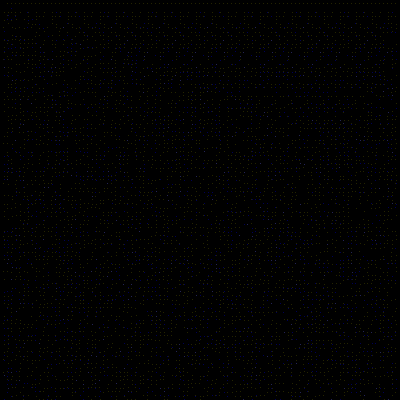

# Diagonal function

An animated reproduction of the painting "Função Diagonal" (Diagonal function), 1952, by artist Geraldo de Barros.
More about the artist at http://www.geraldodebarros.com/main/

