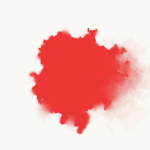

At the rose garden
==================


Water color effect
------------------

*At the rose garden* was an experiment with the ideas presented by
artist Tyler Hobbs in his article [*A generative approach to simulating
watercolor paints*](http://www.tylerlhobbs.com/writings/watercolor). The idea of the algorithm is to draw a polygon,
for example a decahedron, and replace each side AB with two new
segments, AC\' and C\'B, where C\' is a point around the midpoint C
between A an B. Taylor uses the Gaussian distribution to determine C\'
from C, meaning most points will be very close to C, and a few will be
very distant from C, causing an organic feel to the distortion.
  
  
*How the algorithm works. Images (C) Tyler Hobbs

|||
|-|-|
|||
|||


The `deformBlob()` method is one possible implementation of the algorithm above.

``` Java
ArrayList<PVector> deformBlob(ArrayList<PVector> basePolygon, int iterations) {
    ArrayList<PVector> blob = new ArrayList<PVector>();
    blob.clear();
    for (int j=0, si=basePolygon.size(); j<si; j++) {
        blob.add(basePolygon.get(j));
    }

    for (int i = 1; i < iterations; i++) {
        vertices = new ArrayList<PVector>();
        for (int v =0, l = blob.size(); v<l; v++) {
        PVector A = blob.get((v%l));
        PVector B = blob.get((v+1)%l);
        PVector C = PVector.lerp(A, B, 0.5); //medium point

        // Get a gaussian random number w/ mean of 0 and standard deviation of m
        // moves point B by adding to the Gaussian number
        float m = A.dist(B);
        C.x +=randomGaussian() * m * .25;
        C.y +=randomGaussian() * m * .25;

        vertices.add(A);
        vertices.add(C);      
        //Note we don't add "B", since it would be added twice
        //"B" is "A" in the next iteration of "i"

        }
        blob.clear();
        for (int j=0, si=vertices.size(); j<si; j++) {
        blob.add(vertices.get(j));
        }
    }
    vertices.clear();
    return blob;
}
```
