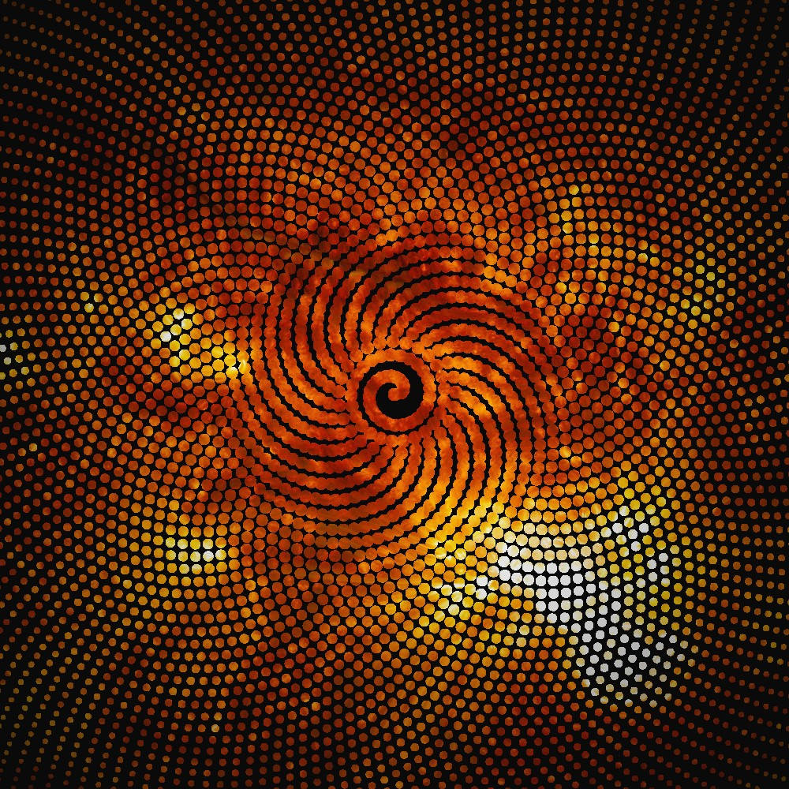
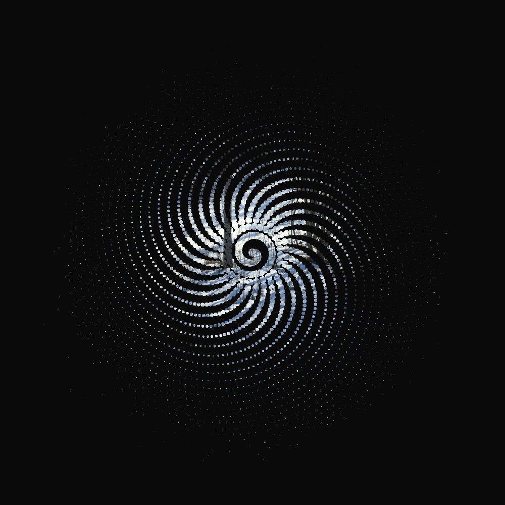
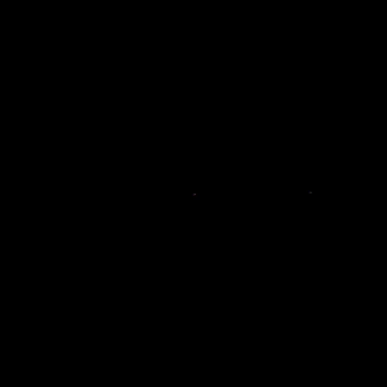

# Phyllotaxis
This animation is based on [Daniel Shiffman tutorial on phyllotaxis](https://www.youtube.com/watch?v=KWoJgHFYWxY&feature=youtu.be). 

I modified the original code to mask a background image, and to change the parameters for the so-called _divergence angle_ (according to mouse X position), and the size of the initial "seed".

# Examples

| C | Angle | Example |
|----:|--:|--------|
|4.05|296.98||
|7.41|12.94||


# The Shining
Here I used again the still from the movie The Shining as the background, and created several images, varying the parameter `c` from 4 to 12, and finally uploading the images to [Giphy](https://giphy.com/).




# How to run
Open `sunflower.pde` in Processing. To play with other images, add them to the `data` folder and change the code with `loadImage()`:
```java
  img = loadImage("model_1.png");
```

