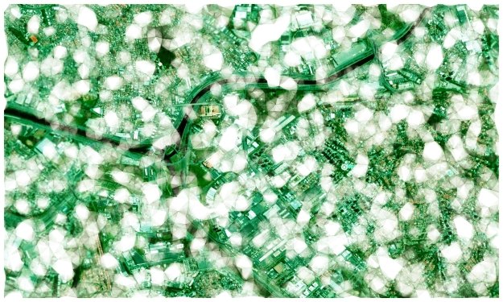

---
---
# The output

# Input
The high-resolution satellite image was created using [SAS Planet](https://bitbucket.org/sas_team/sas.planet.bin/downloads/), with images from the Bing service. After zooming to desired area, use CTRL+A to open the Selection manager dialog. Go to Stich tab, choose a zoom factor which generates a large enough image.
I used a zoom factor 16, and cropped/edited the image according to the aspect ratio and resolution.

# Image size and aspect ratio
For best results the input image should match the aspect ratio of the desired output. For 3x4 aspect ratio, I used a satellite image of 3750x5000 pixels, which was good enough for a `30cm x 40cm` print.
=======
---
layout: default
---
# Triangles

>>>>>>> 8e99a0bdc48c85347837ff21b0dcfecd7aa8217d

# Input
The high-resolution satellite image was created using [SAS Planet](https://bitbucket.org/sas_team/sas.planet.bin/downloads/), with images from the Bing service. After zooming to desired area, use CTRL+A to open the Selection manager dialog. Go to Stich tab, choose a zoom factor which generates a large enough image.
I used a zoom factor 16, and cropped/edited the image according to the aspect ratio and resolution.

# Image size and aspect ratio
For best results the input image should match the aspect ratio of the desired output. For 3x4 aspect ratio, I used a satellite image of 3750x5000 pixels, which was good enough for a `30cm x 40cm` print.
