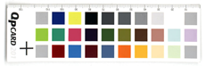
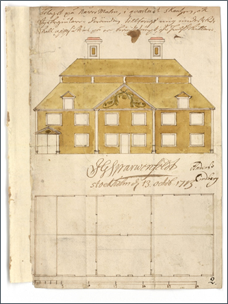
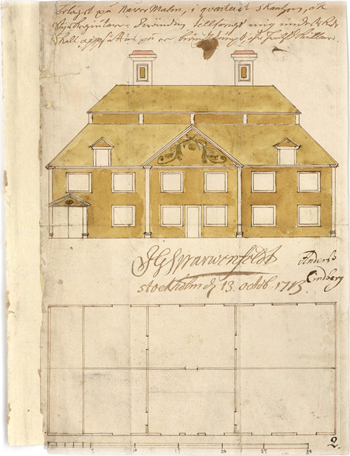
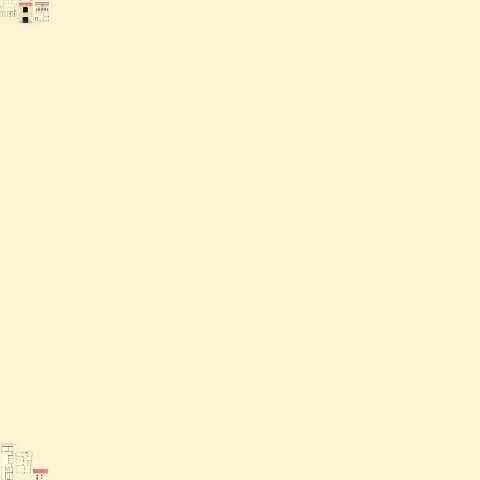

# Stockholm architecture drawings
This composition was made using images from [Stockholm City Open Data Service](http://data.stockholm.se/)[<sup>1</sup>](#References)
Since this particular data set is not available via an API, I used a Python script to download the images from the site, along with 
the metadata from the page.  


# Preparation (Python/OpenCV)
I used OpenCV to remove the color guide part which was added to the bottom of the scanned images. I cropped one color card and used as a "template" for the openCV `matchTemplate` function.

```Python
cv2.matchTemplate(image,template,cv2.TM_CCOEFF_NORMED
```
After cropping from the template, I used  `cv2.findContours` to located the actual drawing in the image, and finally cropping to the largest contour and applying a mask to blur the edges of each image.

Template|Cropping color card|Contour detection and mask
---|---|---|
||

# Composition
With all the images prepared in Python, the composition is rather simple. It tries to fill up the canvas from the top and from the bottom, adding more images in between. The animation below shows the algorithm in action.



# References
[1] Data set __Bygglovsritningar__ (architectural drawings). Available at [http://data.stockholm.se/List/Data/bygglovsritningar](http://data.stockholm.se/List/Data/bygglovsritningar).
