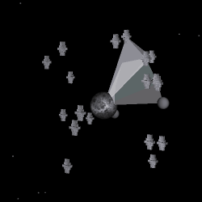

# Orbital Challenge: coding challenge flerting with 3D visualization.
This sketch is the 3D visualization of a routing challenge. In the interactive page, tap SOLVE button to show the solution. Tap anywhere to hide/show the planet.
[Live sketch](sketch.md)

[[]](sketch.md)

# The original challenge
"Create an algorithm that can route phone calls through space across a network of satellites [...]. No signal can travel through Earth!" © Reaktor 2016.

# Techniques
Rendering done using [p5.js](https://p5js.org)