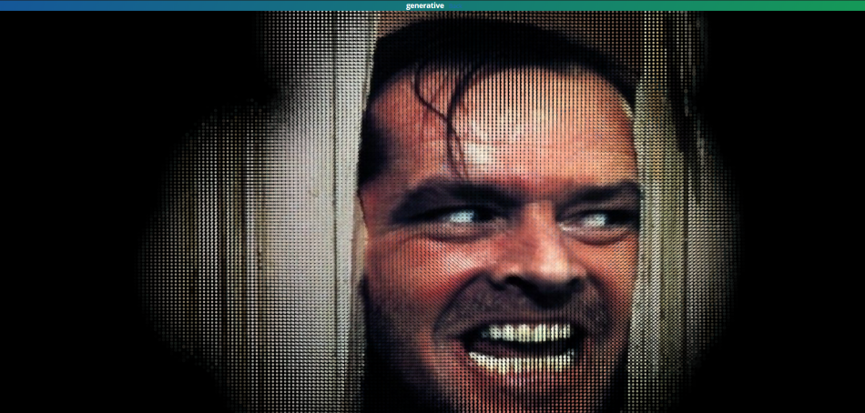
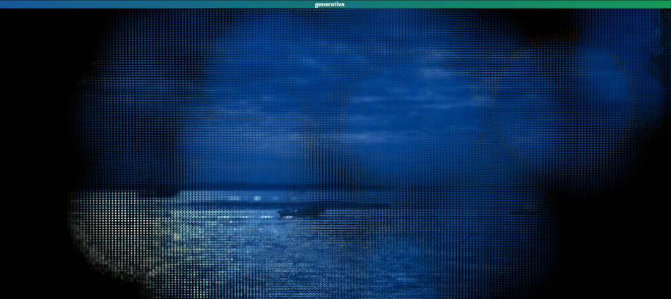

# Flashlight
An interactive way to explore photographs. The image is painted on the canvas in a rounded pixelated effect, as if the viewer was shedding on it with a flashlight.  

[See live sketch - The Shining](sketch.md)

  

[See live sketch - Harbour at night](sketch.html?img=01)  

# Tecniques
Techniques: P5JS, noise, average brightness. Landscape recommended on mobile devices.

# How it works
A circle is drawn along the movement of the mouse, and each circle is in turned painted by tiny orther circles. The color of each small circle is the average color in the center of each circle. The further from the mouse position, the darker the tiny circles become:

Full source code [here](https://github.com/haschdl/generative/tree/master/p5jsFlashlight)

# Credits
Harbor pictures by [Andre Vicentini](http://www.andrevicentini.eu/). Still from moview "The Shining": most likely a copyright infringement.
