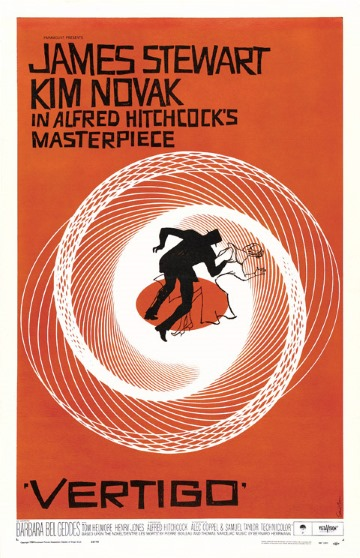

# Vertigo

A recreation of [Saul Bass](https://en.wikipedia.org/wiki/Saul_Bass) art for the cover of the movie Vertigo (1978), directed by Alfred Hitchcock.  
  
Saul was the master of movie titles, and the father of "kinect typography", the technique to mix text and animation to express idea. The elegance and simplicity of Saul's design is still of great influence to cinema. See more of his work [here](https://www.youtube.com/watch?v=4nASwfToZfQ)

# [Live sketch](sketch.md)  
Live sketch works best in desktop.

# OpenProcessing 
The same sketch is published in OpenProcessing [here](https://www.openprocessing.org/sketch/543268) - easier to fork and make small adjustments.
