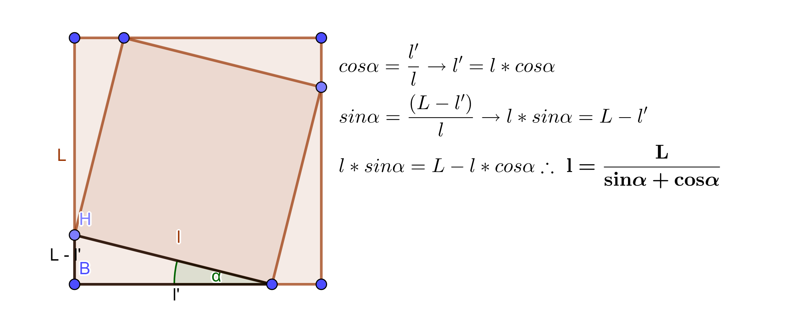
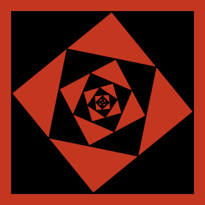
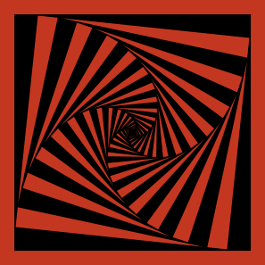
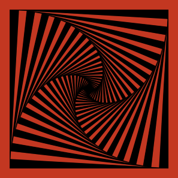

# Vertigo III
> Part of the [Vertigo series](./p5jsVertigo/)  

Vertigo III is a sequence of squares drawn inside another square, painted with alternate colors.  
In each `draw()` cycle I apply a rotation and scale down the rectangle.  


The size of the next rectangle `l`is calculated from the previous rectangle `L` according to the rotation angle as follows:  
  

A larger &alpha; generates less detailed image:
|Value of &alpha;|Result|
|:--:|:--:|
|0.89||
|0.10||
|0.06||

I use the same formula in code, but I can simply reasign the new value to the same variable:
```javascript
  rect(0, 0, s, s );
  s = s / (sin(a) + cos(a));
```


Colors are changed with modulus function:  
```javascript
  if(frameCount % 2 == 0)
    fill(mainColor);
  else fill(0);
```

